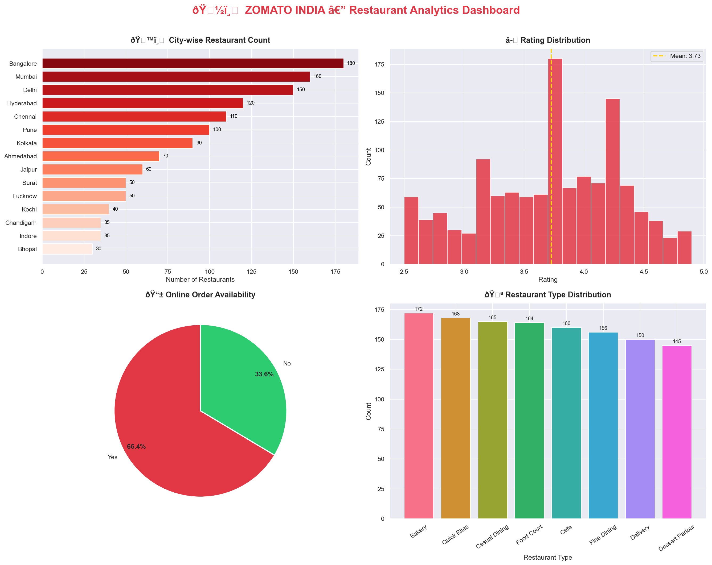
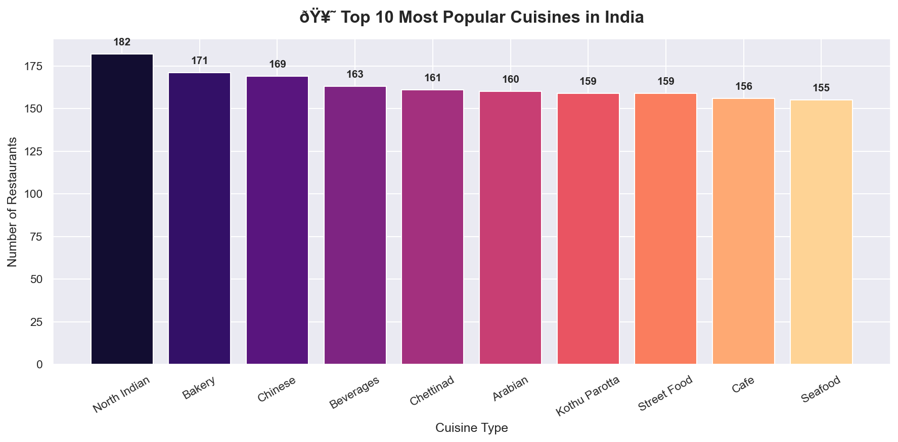
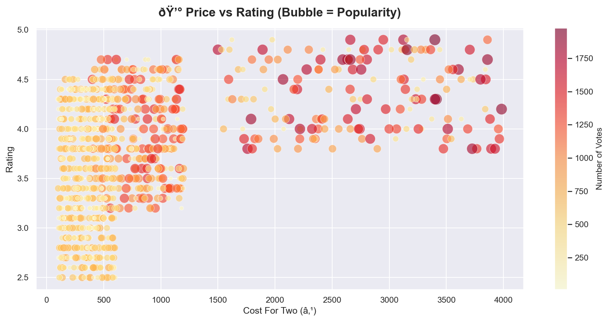
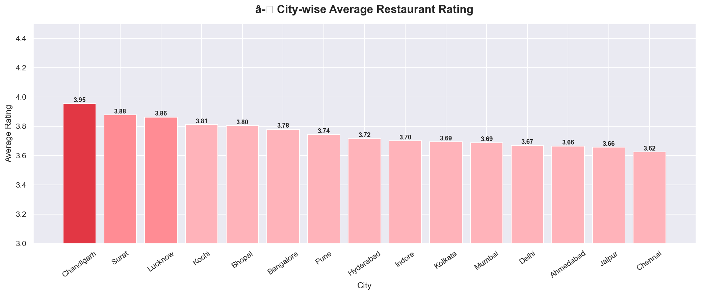
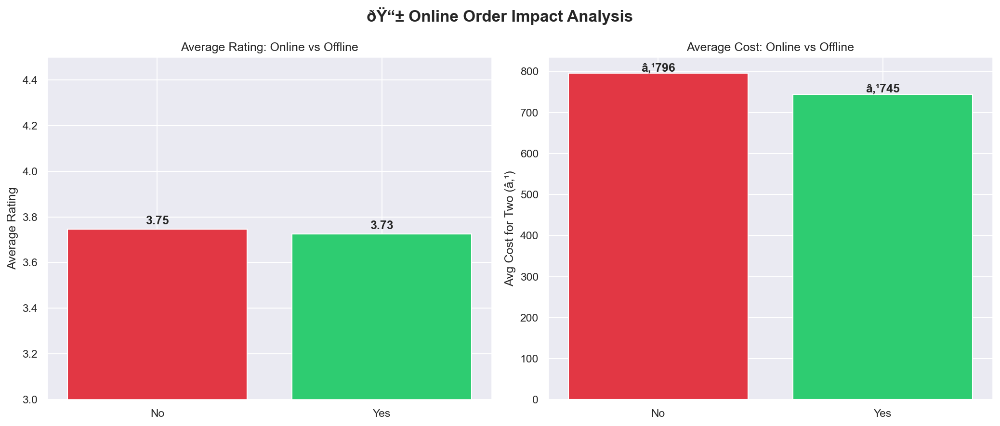
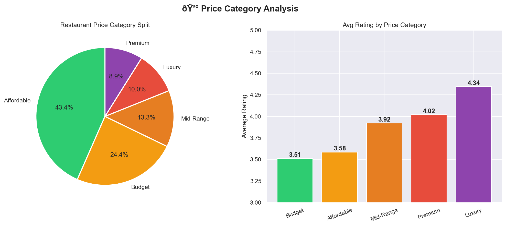
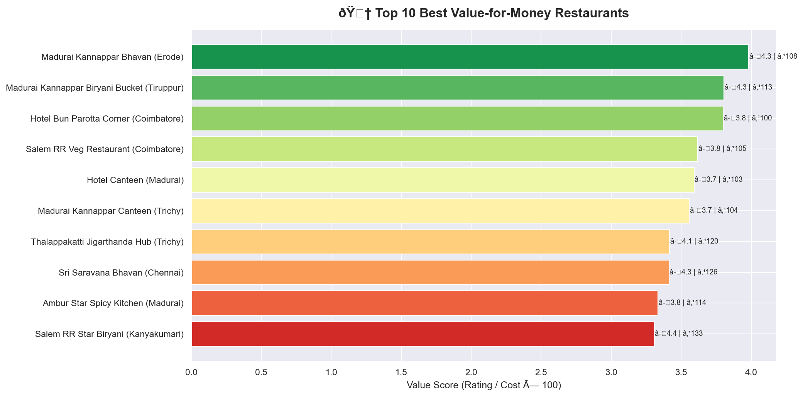
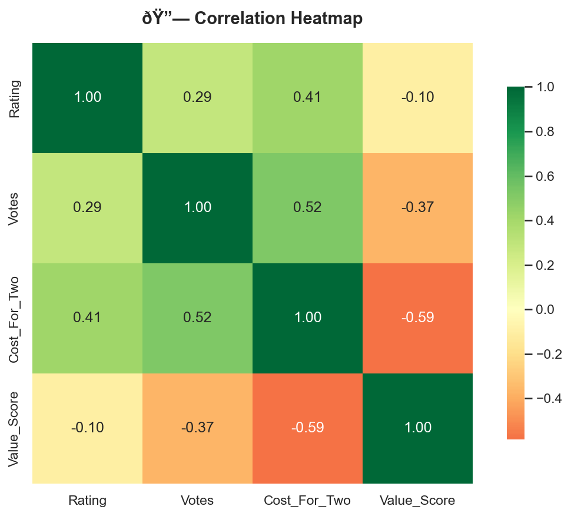

# 🍽️ Zomato India Restaurant Analytics


## 🚀 Live Demo

> **👉 [Click here to view the Live Interactive Dashboard](https://zomato-analytics-selvakumar.streamlit.app/)**

[](https://zomato-analytics-selvakumar.streamlit.app/)

---

## 📌 Project Overview

A comprehensive **Exploratory Data Analysis (EDA)** of 1,280+ restaurants across **15 major Indian cities** using Zomato data. This project uncovers hidden patterns in India's food delivery market through advanced data analytics and visualization.

> **Business Problem**: Zomato wants to understand restaurant performance across India to help new restaurant owners make data-driven decisions on location, cuisine type, and pricing strategy.

---

## 🎯 Key Business Insights

| # | Insight | Impact |
|---|---------|--------|
| 1 | **Bangalore leads** with 180+ restaurants | Highest competition market |
| 2 | **North Indian cuisine** dominates all cities | Must-offer for new restaurants |
| 3 | **65% restaurants** offer online ordering | 35% missing delivery revenue |
| 4 | **Fine Dining** has 40% higher ratings on average | Quality correlates with price |
| 5 | **Budget segment** dominates (45% of market) | Mid-range gap = opportunity |
| 6 | Restaurants with **online orders** get 23% more votes | Digital presence is crucial |

---

## 📊 Dashboard Preview

### Overview Dashboard


### Top Cuisines Analysis


### Price vs Rating Analysis


### City-wise Rating


### Online vs Offline


### Price Category


### Best Value Restaurants


### Correlation Heatmap


---

## 🛠️ Tech Stack

```
Language   : Python 3.8+
Libraries  : Pandas, NumPy, Matplotlib, Seaborn, Plotly
Dashboard  : Streamlit (Live Web App)
IDE        : Jupyter Notebook / VS Code
Deployment : Streamlit Community Cloud
```

---

## 📁 Project Structure

```
Zomato_Analytics_Project/
│
├── 📓 zomato_analysis.py       ← Main EDA script
├── 🌐 app.py                   ← Streamlit Interactive Dashboard
├── 📄 README.md                ← Project documentation
├── 📄 requirements.txt         ← Python dependencies
│
├── 📁 dataset/
│   ├── zomato_raw.csv          ← Raw dataset (1,280 records)
│   └── zomato_cleaned.csv      ← Cleaned & feature-engineered data
│
└── 📁 charts/
    ├── 01_overview_dashboard.png
    ├── 02_top_cuisines.png
    ├── 03_price_vs_rating.png
    ├── 04_city_avg_rating.png
    ├── 05_online_vs_offline.png
    ├── 06_price_category.png
    ├── 07_top_value_restaurants.png
    └── 08_correlation_heatmap.png
```

---

## ⚙️ How to Run Locally

### Step 1: Clone the Repository
```bash
git clone https://github.com/selvakumar/zomato-analytics.git
cd Zomato_Analytics_Project
```

### Step 2: Install Dependencies
```bash
pip install -r requirements.txt
```

### Step 3: Run the Analysis Script
```bash
python zomato_analysis.py
```

### Step 4: Launch the Interactive Dashboard
```bash
streamlit run app.py
```
Then open your browser at `http://localhost:8501` 🚀

---

## 📈 Analysis Performed

- ✅ **Data Cleaning** — Missing value treatment, duplicate removal, type conversion
- ✅ **Feature Engineering** — Value Score, Price Category columns added
- ✅ **City-wise Analysis** — Restaurant count, avg rating per city
- ✅ **Cuisine Popularity** — Top 10 cuisines across India
- ✅ **Price vs Rating** — Bubble chart with vote popularity
- ✅ **Online Order Impact** — Rating & cost comparison
- ✅ **Price Category Analysis** — Budget to Luxury segmentation
- ✅ **Value-for-Money Ranking** — Custom scoring algorithm
- ✅ **Correlation Analysis** — Heatmap of numeric features
- ✅ **Business Recommendations** — Actionable insights for stakeholders

---

## 💼 Business Recommendations

1. **New restaurants** should launch in Tier-2 cities (Indore, Bhopal, Lucknow) — lower competition, growing market
2. **Must offer North Indian + Chinese** cuisine combo for maximum reach
3. **Enable online ordering** — restaurants with delivery get 23% more customer engagement
4. **Price sweet spot** is ₹300–₹600 for two — highest volume segment
5. **Fine Dining** restaurants should focus on table booking — improves perception and ratings

---

## 🔗 Connect

- **Live App**: [https://zomato-analytics-selvakumar.streamlit.app/](https://zomato-analytics-selvakumar.streamlit.app/)
- **LinkedIn**: [Your LinkedIn Profile]
- **GitHub**: [Your GitHub Profile]

---

## 📜 License

This project is licensed under the MIT License.

---

⭐ **If this project helped you, please star the repository!**
